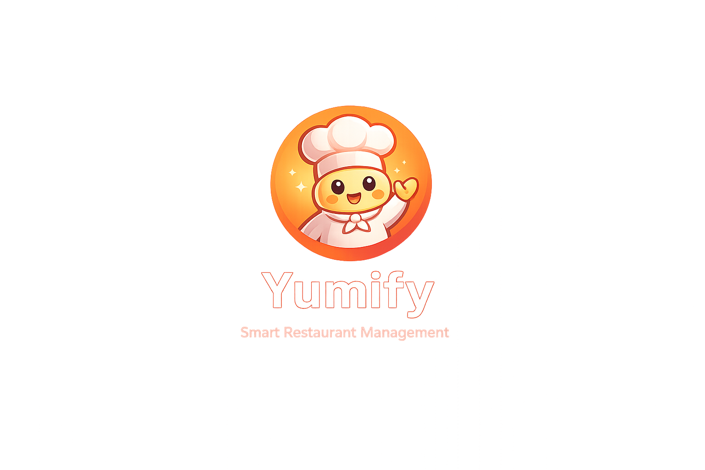

# 🍽️ Yumify V2

<p align="center">
  
</p>

<h3 align="center">
Smart Restaurant Management Platform 🚀
</h3>

<p align="center">
A modern SaaS-style restaurant management platform built with the MERN stack.
</p>

<p align="center">


</p>

---

# 🌐 Live Demo

🔗 Frontend: https://yumify-nine.vercel.app/

---

# 📖 Overview

Yumify is a full-stack restaurant management platform designed to simplify restaurant operations while providing customers with a seamless ordering and reservation experience.

The project started as a team project during the **Digital Egypt Pioneers Initiative (DEPI)** and evolved into a production-ready SaaS-style application.

---

# ✨ Features

## 👥 Customer Features

* User Authentication
* Email Verification
* Forgot Password & Reset Password
* Browse Restaurant Menu
* Food Details Page
* Add/Remove Favorites
* Shopping Cart
* Promo Codes & Discounts
* Table Reservation System
* Order Checkout
* Order Tracking
* User Profile Management
* Dark/Light Theme
* AI Chatbot Assistant

---

## 🏪 Owner Features

* Restaurant Dashboard
* Order Management
* Inventory Management
* Menu Management
* Staff Management
* Supplier Management
* Reservation Management
* Customer Feedback Monitoring
* Promotion & Coupon Management
* Restaurant Settings

---

# 🤖 Ymym — Interactive Mascot

One of Yumify's unique features is **Ymym**, an interactive animated mascot.

Ymym was built from multiple independent assets:

* Head
* Eyes
* Body
* Hands
* Chef Hat

Features include:

* Floating animations
* Eye blinking system
* Hover interactions
* Welcome messages
* Responsive positioning
* Independent animation control for each body part

The goal was to make separate assets behave like a single living character.

---

# 🔐 Authentication Flow

* Register
* Email Verification
* Login
* Protected Routes
* Session Management
* Forgot Password
* Reset Password

Authentication is secured using:

* JWT
* HTTP Only Cookies
* Protected Middleware
* Role-Based Authorization

---

# 🧰 Tech Stack

## Frontend

* React.js
* Tailwind CSS
* React Router
* Axios
* Lucide React
* React Hot Toast

## Backend

* Node.js
* Express.js
* MongoDB
* Mongoose
* JWT Authentication
* Cookie Parser
* Bcrypt

## Services

* MongoDB Atlas
* Resend Email Service
* Railway
* Vercel

---

# 🏗️ Architecture

```text
Client (React)
        ↓
REST API (Express.js)
        ↓
Authentication Layer
        ↓
Business Logic Layer
        ↓
MongoDB Atlas
```

---

# 🚀 Production Challenges Solved

During development several real-world production issues were identified and solved:

* Token generation issues
* Cross-device authentication inconsistencies
* Deployment-specific bugs
* Environment configuration issues
* Email delivery failures
* Dynamic API configuration
* Rendering issues in production
* Cookie persistence debugging

---

# 📁 Project Structure

```bash
YUMIFY/
│
├── client-side/
│   │
│   ├── public/                 # Static assets
│   ├── src/
│   │   ├── apis/               # Axios API instances
│   │   ├── assets/             # Images, icons, static resources
│   │   ├── components/         # Reusable UI components
│   │   ├── config/             # Global configuration files
│   │   ├── context/            # React Context providers
│   │   ├── hooks/              # Custom React hooks
│   │   ├── layouts/            # Application layouts
│   │   ├── pages/              # Application pages/routes
│   │   ├── utils/              # Helper functions
│   │   ├── Ymym/               # Interactive mascot assets & logic
│   │   ├── App.jsx
│   │   ├── main.jsx
│   │   └── index.css
│   │
│   ├── package.json
│   ├── tailwind.config.js
│   ├── vite.config.js
│   └── vercel.json
│
├── server-side/
│   │
│   ├── controllers/            # Business logic
│   ├── middleware/             # Authentication & authorization
│   ├── models/                 # MongoDB schemas
│   ├── routes/                 # API routes
│   ├── services/               # External services (email, AI, etc.)
│   ├── utils/                  # Backend helper utilities
│   ├── uploads/                # Uploaded files storage
│   ├── config/                 # Server configuration
│   ├── app.js
│   └── server.js
│
├── uploads/                    # Shared uploaded assets
├── .env
├── .gitignore
├── package.json
└── README.md
```

## 📂 Frontend Architecture

```text
pages/
│
├── Home
├── FoodDetails
├── Cart
├── Profile
├── Orders
├── Favorites
├── Reservation
├── Login
├── Register
├── ForgotPassword
├── ResetPassword
└── Owner Dashboard Pages

components/
│
├── Navbar
├── Footer
├── Chatbot
├── CartItem
├── Food
├── Loading
└── Shared UI Components

Ymym/
│
├── Head
├── Body
├── Eyes
├── Hands
├── ChefHat
└── Animation System
```

## 🏛️ Backend Architecture

```text
Request
   ↓
Express Routes
   ↓
Middlewares
   ↓
Controllers
   ↓
MongoDB Models
   ↓
MongoDB Atlas
```

```

---

# ⚙️ Installation

## Clone Repository

```bash
git clone https://github.com/your-username/yumify.git
```

## Install Dependencies

### Frontend

```bash
cd client-side
npm install
npm run dev
```

### Backend

```bash
cd server-side
npm install
npm start
```

---

# 🔑 Environment Variables

## Backend `.env`

```env
PORT=5000

MONGO_URI=

JWT_SECRET=

EMAIL=
EMAIL_PASS=

RESEND_API_KEY=

CLIENT_URL=

NODE_ENV=production
```

---

# 👨‍💻 Team

### Backend Architecture

**Assem**

### UI/UX Design & Theme System

**Saif**

### Owner Dashboard & Initial Deployment

**Omar**

### Authentication, Reservations, Deployment, Production Debugging & Customer Experience

**Mohamed Essam**

---

# 🏆 Achievements

🏅 Recognized as one of the **Best React Projects** in the DEPI Program.

---

# 📈 Future Plans

* Online Payments Integration
* Advanced Analytics
* Notifications System
* Multi-Restaurant Support
* Real SaaS Subscription Plans
* Cloud Image Storage
* AI Enhancements

---

# 🤝 Contributing

Contributions, suggestions, and feedback are always welcome.

Feel free to fork the project and open a Pull Request.

---

# ⭐ Support

If you like this project, consider giving it a **star ⭐** on GitHub.

---

<p align="center">
Made with ❤️ by Team Yumify
</p>
