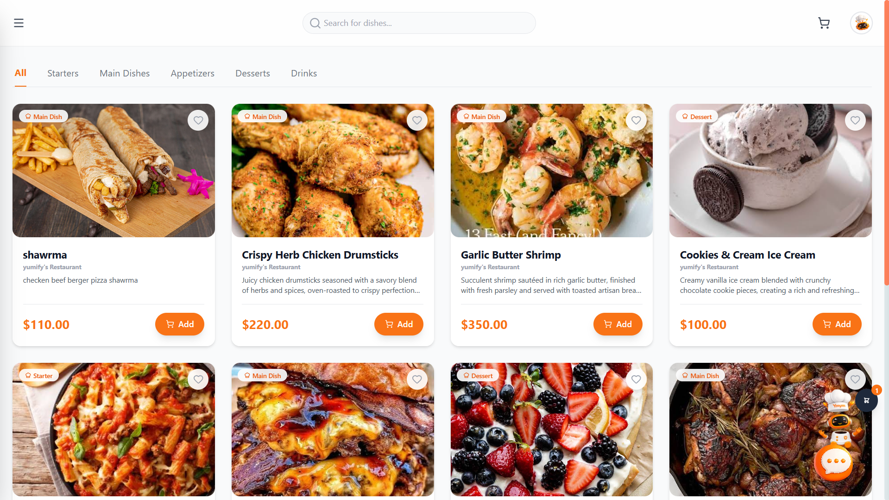
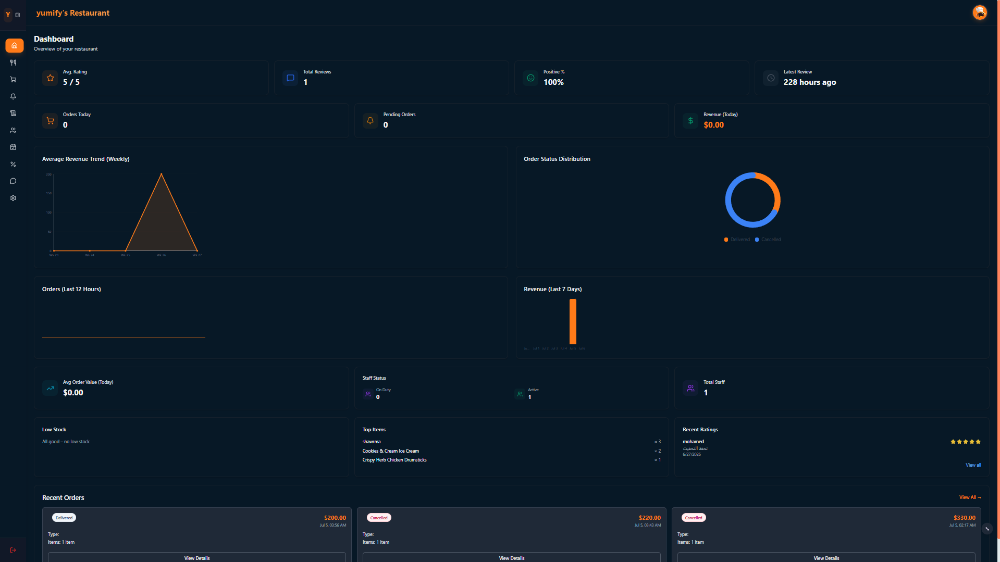
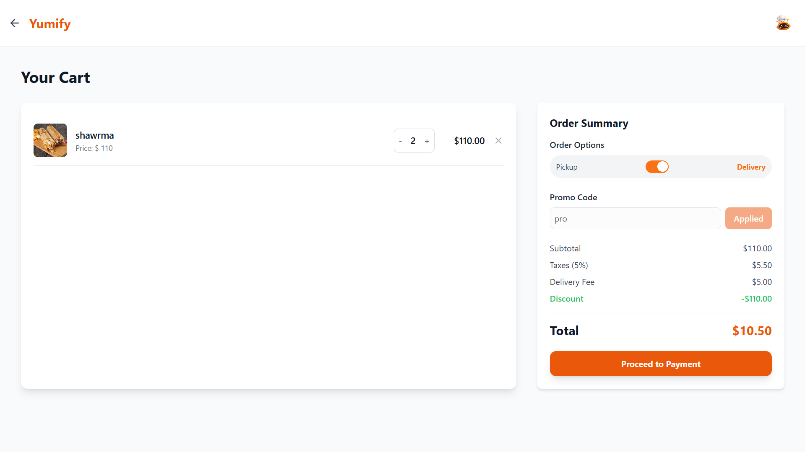
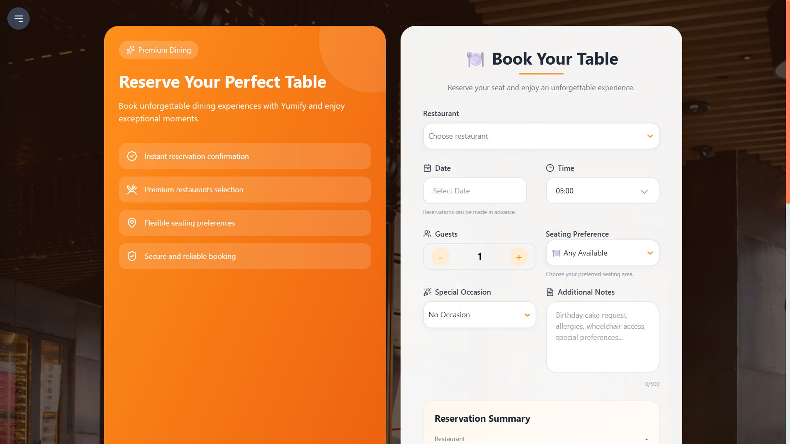
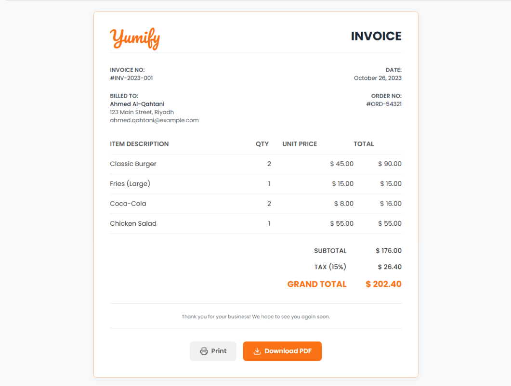
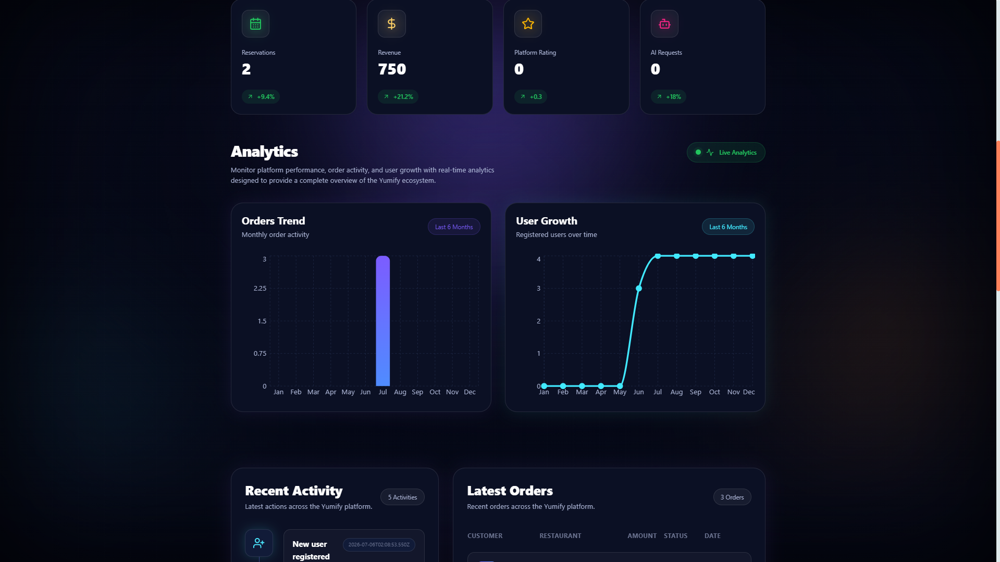
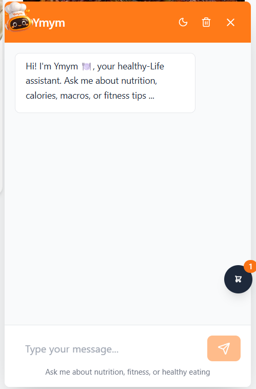

# 🍽️ Yumify

<p align="center">
  
</p>

<h1 align="center">
Yumify – Production-Ready Restaurant Management Platform
</h1>

<p align="center">
A modern SaaS-inspired restaurant management platform built with the MERN Stack and deployed on AWS using Docker, Amazon ECS (Fargate), ECR, Application Load Balancer, Nginx, and GitHub Actions CI/CD.
</p>

<p align="center">


</p>

---

# 🌍 Live Demo

> **Frontend (AWS ECS + ALB)**

```
http://yumify-alb-1478565898.eu-north-1.elb.amazonaws.com
```

---

# 📖 About Yumify

Yumify is a **production-oriented restaurant management platform** designed to provide a complete digital solution for restaurants and their customers.

Customers can browse menus, reserve tables, place orders, track deliveries, and interact with an AI-powered restaurant assistant.

Restaurant owners receive a comprehensive dashboard to manage:

- Orders
- Menu Items
- Reservations
- Promotions
- Staff
- Restaurant Settings
- Customer Reviews

Originally developed as a graduation project during the **Digital Egypt Pioneers Initiative (DEPI)**, Yumify evolved into a production-style cloud application focusing on scalable architecture, deployment automation, authentication, DevOps, and modern software engineering practices.

---

# ✨ Project Highlights

✅ MERN Stack Architecture

✅ Responsive UI

✅ Owner Dashboard

✅ Customer Dashboard

✅ AI Restaurant Assistant

✅ JWT Authentication

✅ HTTP-only Cookie Authentication

✅ Email Verification

✅ Password Reset

✅ Restaurant Reservation System

✅ Order Tracking

✅ Promotions & Coupons

✅ Favorites System

✅ Dark / Light Theme

✅ Dockerized Frontend & Backend

✅ Nginx Reverse Proxy

✅ AWS ECS (Fargate)

✅ Amazon ECR

✅ Application Load Balancer

✅ GitHub Actions CI/CD

✅ Production Deployment

---

# 🎯 Objectives

Yumify was built to simulate how a real SaaS restaurant platform works while applying production-level development practices.

The project focuses on:

- Clean Architecture
- Maintainable Code Structure
- Scalable REST APIs
- Secure Authentication
- Responsive User Experience
- Cloud Deployment
- CI/CD Automation
- Production Debugging
- Team Collaboration

---

# 👥 User Roles

Yumify currently supports multiple user roles.

## 👤 Customer

Customers can:

- Create an account
- Verify their email
- Browse restaurants
- Search foods
- Add items to favorites
- Manage shopping cart
- Apply coupons
- Reserve tables
- Track orders
- Manage profile
- Leave reviews
- Chat with AI Assistant

---

## 🏪 Restaurant Owner

Restaurant owners can:

- Access Owner Dashboard
- Manage Menu
- Add/Edit/Delete Foods
- Manage Orders
- Manage Reservations
- Manage Promotions
- Manage Staff
- Manage Suppliers
- Update Restaurant Settings
- Monitor Customer Reviews

---
## 🛡️ Admin Dashboard

Yumify includes a modern Admin Dashboard designed to provide platform-wide visibility and system monitoring.

### Features

- 📊 Real-time platform analytics
- 👥 User, customer, and restaurant statistics
- 📦 Order and reservation overview
- 💰 Revenue tracking
- ⭐ Average platform rating
- 📈 Interactive analytics charts
- ⚡ Recent platform activity timeline
- 🛒 Latest orders monitoring
- 🏆 Top-performing restaurants leaderboard
- 🖥️ Platform health monitoring
- 🔐 Secure role-based admin authorization

The dashboard is built with reusable React components, responsive layouts, animated charts, and a modern SaaS-inspired interface while consuming analytics from dedicated backend APIs.

---
# 🤖 Ymym — Interactive Restaurant Mascot

One of Yumify's unique features is **Ymym**, an animated interactive mascot that welcomes users throughout the application.

Unlike a traditional illustration, Ymym was built from multiple independent assets:

- Head
- Eyes
- Hands
- Body
- Chef Hat

Each part is animated independently to create the illusion of a living character.

Features include:

- Floating Animation
- Eye Blinking
- Hover Effects
- Responsive Positioning
- Interactive Welcome Messages
- Independent Body Animations

---

# 🚀 Key Features

## 🔐 Authentication

- User Registration
- Email Verification
- Login
- Logout
- Forgot Password
- Reset Password
- Protected Routes
- Role-Based Authorization
- HTTP-only Cookie Authentication
- JWT Session Management

---

## 🍽 Food Ordering

- Browse Foods
- Categories
- Search
- Food Details
- Favorites
- Shopping Cart
- Coupons
- Checkout
- Order History
- Order Tracking

---

## 📅 Reservation System

Users can:

- Reserve Tables
- Select Date & Time
- View Reservation Status
- Cancel Reservation
- Manage Reservations

Owners can:

- Accept Reservations
- Reject Reservations
- View Upcoming Reservations

---

## 🤖 AI Restaurant Assistant

Integrated AI assistant capable of:

- Recommending Foods
- Restaurant Information
- Answering Customer Questions
- Improving Customer Experience

---

## 🌙 Theme System

- Dark Theme
- Light Theme
- Responsive Layout
- Smooth UI Experience

---

# 🛠 Tech Stack

## Frontend

- React.js
- Vite
- Tailwind CSS
- React Router
- Axios
- Context API
- React Hot Toast
- Lucide Icons

---

## Backend

- Node.js
- Express.js
- MongoDB Atlas
- Mongoose
- JWT
- Cookie Parser
- Bcrypt
- Nodemailer / Resend
- REST API

---

## DevOps

- Docker
- Docker Compose
- Nginx
- Amazon ECS (Fargate)
- Amazon ECR
- Application Load Balancer
- GitHub Actions
- CloudWatch Logs

---

# 🏗 High-Level Architecture

```text
                        Users
                          │
                          ▼
             Application Load Balancer
                          │
         ┌────────────────┴────────────────┐
         │                                 │
         ▼                                 ▼
 Frontend Container                 Backend Container
 (React + Nginx)                  (Node.js + Express)
         │                                 │
         └──────────────┬──────────────────┘
                        │
                        ▼
                 MongoDB Atlas
                        │
                        ▼
         Authentication • Orders • Foods
      Reservations • Promotions • Reviews
```

---

# 🧠 System Design

Yumify follows a layered architecture separating presentation, business logic, and persistence.

```text
Client
   │
REST API
   │
Authentication Layer
   │
Controllers
   │
Business Logic
   │
MongoDB Models
   │
MongoDB Atlas
```

---

# 📸 Screenshots

<p align="center">




</p>

<p align="center">




</p>

<p align="center">




</p>

<p align="center">




</p>
---
# 📁 Project Structure

```text
YUMIFY/
│
├── .github/
│   └── workflows/
│       ├── deploy.yml                 # Existing deployment workflow
│       └── deploy-ecs.yml             # AWS ECS CI/CD pipeline
│
├── client-side/
│   │
│   ├── public/
│   │   ├── logo.png
│   │   ├── default.png
│   │   ├── defaultItem.png
│   │   └── Static Assets
│   │
│   ├── src/
│   │   ├── apis/
│   │   ├── assets/
│   │   ├── components/
│   │   ├── config/
│   │   ├── context/
│   │   ├── hooks/
│   │   ├── layouts/
│   │   ├── pages/
│   │   ├── routes/
│   │   ├── services/
│   │   ├── utils/
│   │   ├── Ymym/
│   │   ├── App.jsx
│   │   ├── main.jsx
│   │   └── index.css
│   │
│   ├── Dockerfile
│   ├── nginx.conf
│   ├── package.json
│   └── vite.config.js
│
├── server-side/
│   │
│   ├── config/
│   ├── controllers/
│   ├── middleware/
│   ├── models/
│   ├── routes/
│   ├── services/
│   ├── uploads/
│   ├── utils/
│   ├── validators/
│   ├── server.js
│   └── package.json
│
├── uploads/
│
├── Dockerfile
├── docker-compose.yml
├── README.md
└── package.json
```

---

# ⚛ Frontend Architecture

The frontend follows a modular architecture designed for scalability and maintainability.

```text
src
│
├── apis/
│      API communication layer
│
├── assets/
│      Images, Icons, Videos
│
├── components/
│      Shared reusable UI
│
├── config/
│      Global configurations
│
├── context/
│      Global State Management
│
├── hooks/
│      Custom React Hooks
│
├── layouts/
│      Layout Components
│
├── pages/
│      Route Pages
│
├── services/
│      Business services
│
├── utils/
│      Helper functions
│
└── Ymym/
       Interactive Mascot System
```

---

# 🖥 Backend Architecture

The backend follows a layered architecture where every responsibility is isolated.

```text
Request
     │
     ▼
Express Router
     │
     ▼
Middlewares
(Authentication
Authorization
Validation)
     │
     ▼
Controllers
     │
     ▼
Services
     │
     ▼
MongoDB Models
     │
     ▼
MongoDB Atlas
```

This architecture keeps business logic separated from routing, making the application easier to maintain and extend.

---

# 🔐 Authentication Flow

```text
Register
    │
    ▼
Email Verification
    │
    ▼
Login
    │
Generate JWT
    │
Store HTTP-only Cookie
    │
Protected Middleware
    │
Authorized Routes
```

Authentication uses:

- JWT Tokens
- HTTP-only Cookies
- Role-Based Authorization
- Password Hashing (Bcrypt)
- Email Verification
- Password Reset Tokens

---

# 📡 REST API Architecture

```text
Client
   │
Axios
   │
REST API
   │
Express Routes
   │
Controllers
   │
Services
   │
MongoDB
```

The frontend communicates with the backend through a centralized API layer using Axios.

---

# 📦 API Modules

The backend is organized into feature-based modules.

- Authentication
- Foods
- Orders
- Cart
- Favorites
- Reservations
- Promotions
- Reviews
- Notifications
- Restaurant
- Staff
- Suppliers
- Chatbot

Each module follows the same structure:

```text
Route
   │
Controller
   │
Service
   │
Database
```

---

# 🐳 Docker Architecture

Yumify is fully containerized.

```text
                Docker
                   │
      ┌────────────┴────────────┐
      │                         │
      ▼                         ▼
Frontend Container        Backend Container
(React + Nginx)          (Node + Express)
      │                         │
      └────────────┬────────────┘
                   │
                   ▼
              MongoDB Atlas
```

## Frontend Container

- Multi-stage Docker Build
- Optimized Production Image
- Nginx Static Server
- SPA Routing Support

## Backend Container

- Node.js Runtime
- Express Server
- JWT Authentication
- REST APIs

---

# ☁ AWS Infrastructure

The production deployment runs entirely on AWS.

```text
                    Internet
                        │
                        ▼
         Application Load Balancer
                        │
         ┌──────────────┴──────────────┐
         │                             │
         ▼                             ▼
Frontend Target Group          Backend Target Group
         │                             │
         ▼                             ▼
Frontend ECS Service         Backend ECS Service
         │                             │
         └──────────────┬──────────────┘
                        │
                        ▼
                  Amazon ECS
                    Fargate
                        │
                        ▼
                 Amazon ECR Images
                        │
                        ▼
                  MongoDB Atlas
```

AWS Services Used:

- Amazon ECS (Fargate)
- Amazon ECR
- Application Load Balancer
- Target Groups
- Security Groups
- CloudWatch Logs
- IAM

---

# 🔄 CI/CD Pipeline

The application is automatically deployed using GitHub Actions.

```text
Developer
     │
git push
     │
     ▼
GitHub Actions
     │
Detect Changed Files
     │
Build Docker Image
     │
Push Image to Amazon ECR
     │
Create New ECS Task Revision
     │
Deploy ECS Service
     │
Health Checks
     │
Production Ready
```

The deployment pipeline automatically:

- Detects project changes
- Builds production Docker images
- Pushes images to Amazon ECR
- Registers a new ECS Task Definition
- Deploys the new version
- Waits until the deployment becomes healthy

No manual deployment is required.

---

# 🌐 Networking

The infrastructure uses an Application Load Balancer for routing.

```text
/
│
▼
Frontend (React)

----------------------------

/api/*
│
▼
Backend (Express)
```

This architecture allows:

- Single Public Endpoint
- No Backend Public URL
- Automatic Routing
- Better Security
- No CORS Issues

---

# 🔒 Security Features

Authentication & Authorization

- JWT Authentication
- HTTP-only Cookies
- Protected Middleware
- Owner Authorization
- Customer Authorization

Application Security

- Password Hashing
- Email Verification
- Secure Cookie Configuration
- Environment Variables
- Input Validation
- Error Handling

Infrastructure Security

- AWS Security Groups
- ECS Task Isolation
- IAM Roles
- Load Balancer Routing

---

# 📂 Design Principles

The project follows several software engineering principles:

- Component-Based Architecture
- Separation of Concerns
- Reusable Components
- Feature-Based Organization
- RESTful API Design
- Modular Backend Structure
- Environment-Based Configuration
- Production-Oriented Deployment

---
# 🚀 Getting Started

## Clone Repository

```bash
git clone https://github.com/MohamedEssam11111/yumify-.git

cd yumify-
```

---

# 📦 Install Dependencies

## Frontend

```bash
cd client-side

npm install

npm run dev
```

---

## Backend

```bash
cd server-side

npm install

npm start
```

---

# 🐳 Running with Docker

Build and start the complete application:

```bash
docker compose up --build
```

Run in detached mode:

```bash
docker compose up -d
```

Stop containers:

```bash
docker compose down
```

---

# ⚙ Environment Variables

## Frontend

```env
VITE_API_URL=
```

When deploying behind an Application Load Balancer the API URL can remain empty:

```env
VITE_API_URL=
```

The frontend will automatically use relative API requests:

```
/api/user/login
```

instead of

```
http://localhost:5000/api/user/login
```

---

## Backend

```env
PORT=5000

MONGO_URI=

JWT_SECRET=

CLIENT_URL=

EMAIL=
EMAIL_PASS=

RESEND_API_KEY=

COOKIE_SECURE=
COOKIE_SAME_SITE=
```

---

# ☁ Production Deployment

Yumify is deployed using AWS cloud services.

Production infrastructure includes:

- Amazon ECS (Fargate)
- Amazon ECR
- Application Load Balancer
- Docker
- Nginx
- GitHub Actions
- CloudWatch

Deployment process:

```
Developer
      │
git push
      │
      ▼
GitHub Actions
      │
Build Docker Images
      │
Push Images to Amazon ECR
      │
Create New ECS Task Definition
      │
Deploy ECS Services
      │
Health Check
      │
Production Ready 🚀
```

No manual deployment is required after the CI/CD pipeline is configured.

---

# 🔄 Continuous Integration & Deployment

GitHub Actions automatically performs:

✅ Checkout Repository

✅ Detect Changed Files

✅ Configure AWS Credentials

✅ Login to Amazon ECR

✅ Build Docker Images

✅ Push Images

✅ Register New ECS Task Definition

✅ Deploy ECS Services

✅ Wait Until Healthy

This enables one-command deployment:

```bash
git push origin main
```

---

# 🧪 Production Challenges Solved

One of the main goals of Yumify was learning how real production systems behave.

During deployment several real-world issues were encountered and solved.

## Authentication

- JWT generation
- HTTP-only cookies
- Cookie persistence
- Secure cookie configuration
- SameSite configuration
- Cross-device authentication

---

## Frontend

- Dynamic API configuration
- Relative API routing
- Production environment variables
- React SPA routing
- Vite production build
- Nginx configuration

---

## Backend

- Express production setup
- Middleware ordering
- Environment configuration
- REST API debugging
- Error handling
- Validation

---

## Docker

- Multi-stage frontend build
- Backend containerization
- Docker Compose
- Image optimization
- Production images

---

## AWS

- Amazon ECS
- Amazon ECR
- ECS Task Definitions
- ECS Services
- Application Load Balancer
- Target Groups
- Security Groups
- Health Checks
- CloudWatch Logs
- IAM Users

---

## GitHub Actions

- GitHub Secrets
- Docker Build
- Amazon ECR Login
- Automatic Deployment
- ECS Service Updates
- Deployment Verification

---

# ⚡ Performance Optimizations

- Multi-stage Docker Builds
- Optimized Production Images
- Nginx Static File Serving
- HTTP-only Authentication Cookies
- Lazy Loaded Components
- Modular React Architecture
- Reusable Components
- Optimized REST APIs

---

# 📚 Lessons Learned

Building Yumify provided hands-on experience with:

### Frontend

- Large React application architecture
- State management
- API abstraction
- Component reusability
- Responsive design

---

### Backend

- REST API architecture
- Authentication systems
- Authorization
- Database modeling
- Validation
- Error handling

---

### DevOps

- Docker
- Docker Compose
- Amazon ECS
- Amazon ECR
- Application Load Balancer
- GitHub Actions
- CI/CD
- Production debugging
- Cloud deployment

---

# 🏆 Achievements

🏅 Developed as a DEPI graduation project.

🏅 Selected as one of the best software projects during the program.

🏅 Successfully deployed to AWS using modern DevOps practices.

🏅 Implemented an automated CI/CD pipeline using GitHub Actions.

🏅 Designed with a scalable SaaS-inspired architecture.

---

# 🔮 Future Improvements

The following features are planned for future versions:

- HTTPS with AWS Certificate Manager
- Custom Domain
- AWS Secrets Manager
- Payment Gateway Integration
- Push Notifications
- Real-time Order Tracking
- Multi-Restaurant Support
- Advanced Analytics Dashboard
- Mobile Application
- AI Recommendation System
- Cloud Image Processing
- CDN Integration

---

# 👨‍💻 Team

## Mohamed Essam

**Frontend Developer**

Main Contributions:

- Frontend Development
- Authentication System
- Reservation System
- Customer Experience
- API Integration
- Dockerization
- AWS Deployment
- ECS Infrastructure
- GitHub Actions CI/CD
- Production Debugging
- Cloud Deployment

---

### Mohamed Ramadan (DevOps Engineer)

- Managed the production deployment on AWS EC2.
- Configured Nginx as a secure reverse proxy for the application.
- Diagnosed and resolved critical Linux server issues including storage bottlenecks and file permission problems.
- Optimized the deployment environment to ensure reliable production operation.
- Assisted with infrastructure configuration and production server maintenance.

---
## Assem

Backend Architecture

---

## Saif

UI / UX Design

---

## Omar

Owner Dashboard Development

---

# 🤝 Contributing

Contributions are welcome.

If you'd like to improve Yumify:

1. Fork the repository
2. Create your feature branch

```bash
git checkout -b feature/amazing-feature
```

3. Commit your changes

```bash
git commit -m "feat: add amazing feature"
```

4. Push the branch

```bash
git push origin feature/amazing-feature
```

5. Open a Pull Request

---

# ⭐ Show Your Support

If you enjoyed this project or found it useful, consider giving it a star ⭐ on GitHub.

It helps others discover the project and motivates future development.

---

# 📄 License

This project was developed for educational purposes as part of the **Digital Egypt Pioneers Initiative (DEPI)** and continues to evolve as a personal learning project.

---

# ❤️ Final Note

Yumify represents much more than a restaurant management system.

It documents the journey of learning modern full-stack development—from building responsive React interfaces and secure Express APIs to containerizing applications with Docker, deploying them to AWS ECS, configuring an Application Load Balancer, automating deployments with GitHub Actions, and solving real production issues encountered along the way.

Every deployment bug, authentication issue, infrastructure challenge, and debugging session contributed to building a deeper understanding of how production software is designed, deployed, and maintained.

The project continues to evolve with the goal of becoming an even more scalable, secure, and production-ready SaaS platform.

---

<p align="center">

### Built with ❤️ by Team Yumify

**⭐ If you like this project, don't forget to star the repository! ⭐**

</p>
